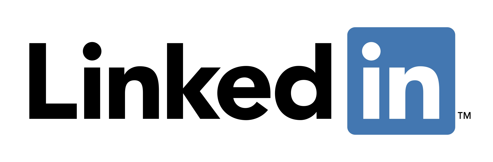

## <h1 align="center"><b>Hola a tod@s y bienvenid@s a mi perfil de GitHub.</b></h1>

## <picture></picture> About me

<picture> </picture>

👋 ¡Hola! Soy Daniel, estudiante de grado superior de Administración de Sistemas Informáticos en Red (ASIR). 

💻 Apasionado por la tecnología, la programación y el aprendizaje continuo. Estoy desarrollando mis habilidades en administración de sistemas, 
redes y desarrollo de software, mientras exploro herramientas y lenguajes como.

- 📡 **Intereses:** Seguridad informática, virtualización y automatización de sistemas.

🎯 **Objetivo:** Convertirme en un profesional versátil en el ámbito IT, contribuyendo a proyectos innovadores y ayudando a solucionar problemas tecnológicos.

🚀 Me encanta aprender nuevas tecnologías y colaborar en proyectos interesantes, así que no dudes en conectar conmigo.

✨ **Más allá de la tecnología:** También me interesan los videojuegos y la lectura.

📬 ¡Contáctame para colaborar o compartir ideas!

<h3 align="center" > Connect with me 🤝 </h3>

## <b> Skills</b>
 

 

- **Softwares and Tools**:

  

   

 
 

<!--
**JohnDSil/JohnDSil** is a ✨ _special_ ✨ repository because its `README.md` (this file) appears on your GitHub profile.

Here are some ideas to get you started:

- 🔭 I’m currently working on ...
- 🌱 I’m currently learning ...
- 👯 I’m looking to collaborate on ...
- 🤔 I’m looking for help with ...
- 💬 Ask me about ...
- 📫 How to reach me: ...
- 😄 Pronouns: ...
- ⚡ Fun fact: ...
-->
